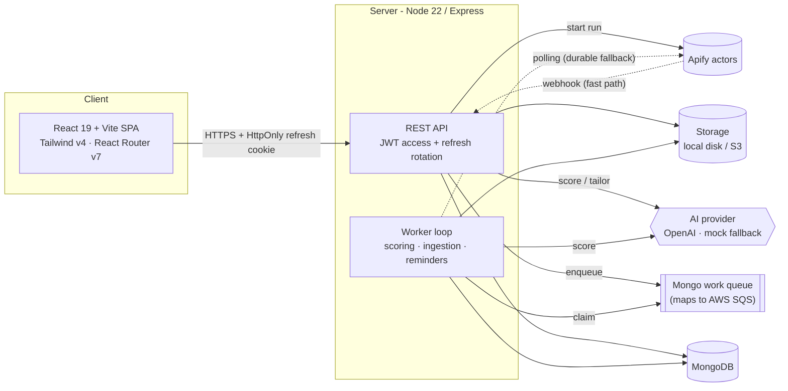

# Cloud Job Tracker + Resume Tailor

[](https://github.com/Arfangalib/cloud-job-tracker/actions/workflows/ci.yml)
[](./LICENSE)

A **MERN + Docker** app for SWE/cloud internship & co-op hunting. Upload a resume,
import jobs, get an AI fit score, tailor truthful **ATS-friendly** resume/cover-letter
content, generate downloadable documents, and track applications end-to-end.

> **Live demo:** _added after deploy_ — see [Deployment](#deployment). The demo runs
> with deterministic AI (`AI_PROVIDER=mock`), so no API keys are required to try it.

---

## Architecture



**Monorepo** (npm workspaces, single root lockfile):

| Path | Stack | Responsibility |
| --- | --- | --- |
| `apps/api` | Node 22 + Express (ESM), Mongoose, Zod, JWT | REST API, auth, AI scoring/tailoring, ingestion, document generation, worker |
| `apps/web` | React 19 + Vite, Tailwind v4, React Router v7, shadcn-style UI | Routed SPA (Dashboard, Jobs, Resume, Documents, Security) |
| `infra/terraform` | AWS (ECS Fargate, SQS, S3, Secrets Manager, CloudWatch) | Production cloud topology |
| `docker-compose.yml` | mongo · api · worker · web | One-command local stack |

## Engineering highlights

These are the parts worth a closer look:

- **Resilient ingestion (fast path + durable fallback).** Apify runs report results
  via a **webhook** (fast path). If the webhook can't reach the API (e.g. no public
  tunnel in local/dev), a **worker poller** checks the Apify run status and imports
  the dataset when it finishes. Completion is **idempotent** via an atomic ingestion
  status claim, so the webhook and poller can race without double-importing or
  double-scoring. _No tunnel required._
- **Pluggable AI with anti-hallucination guardrails.** `AI_PROVIDER=mock` (default)
  gives deterministic keyword scoring/tailoring with explicit guardrails ("do not
  invent employers/dates/certs; only add if true"). `AI_PROVIDER=openai` enables real
  AI with a **graceful fallback** to the deterministic path on error.
- **Secure auth.** Short-lived JWT access tokens + **HttpOnly refresh cookie with
  rotation and reuse-revocation**; sessions restore on reload; the web client
  single-flights token refresh so concurrent 401s share one refresh.
- **ATS-friendly document generation.** Single-column, selectable-text **PDF (pdfkit)**
  and **DOCX (docx)** for resume + cover letter — deliberately *not* HTML→PDF, which
  is ATS-hostile. Rendered from the JSON the tailor step already produces (no extra AI
  cost).
- **Cloud-shaped queue.** A Mongo-backed work queue (claim/complete/retry with
  backoff) that maps cleanly onto **AWS SQS** for production.
- **Pluggable storage.** A single abstraction backs **local disk** (dev) and **S3**
  (prod) for uploads and generated documents.

## Features

- Routed web app: Dashboard, Jobs, Resume, Documents, Security.
- Resume intake by **PDF/DOCX/TXT upload** (pdf-parse + mammoth) or text paste, with
  SWE/cloud keyword extraction.
- Job import via direct sources (Lever/Greenhouse) and Apify-backed URL/search imports.
- AI fit scoring + tailored, downloadable ATS resume & cover letter (PDF + DOCX).
- **Real saved-job search** (text + location/source/minScore) with a **custom recency
  filter** (last 24h / 7d / 30d / any window) backed by a real posting date.
- Application tracker with statuses, notes, reminders, and dashboard analytics.

## Quick start (local)

```bash
npm install
cp apps/api/.env.example apps/api/.env   # PowerShell: Copy-Item apps/api/.env.example apps/api/.env
npm run dev:api
npm run dev:web
```

Or run the full stack with Docker:

```bash
docker compose up --build
```

- API: http://localhost:4000
- Web: http://localhost:5173

**Walkthrough:** register → upload a PDF resume (confirm parsed skills) → import a live
**Lever/Greenhouse** job URL (free, no Apify token; completed by the worker) → Score →
Tailor → generate + download the ATS documents → try Search + recency presets → move an
application through saved → applied → interview → offer.

> **Tip:** upload a primary resume *before* importing jobs — scoring needs a primary
> resume, otherwise it no-ops at score 0.

## Testing

```bash
npm run test --workspace apps/api    # Vitest + supertest (first DB-backed run downloads a Mongo binary)
```

DB-free unit tests plus DB-backed HTTP tests (auth, resume upload, documents, job
search, Apify ingestion + polling) via `mongodb-memory-server`. The same suite runs in
[CI](./.github/workflows/ci.yml) on every PR.

## Configuration

Set these in `apps/api/.env` (see `apps/api/.env.example`; **no secrets are committed**):

```bash
# AI — defaults to deterministic mock; set openai + a key to enable real AI
AI_PROVIDER=mock
OPENAI_API_KEY=
OPENAI_SCORING_MODEL=gpt-5.4-mini
OPENAI_TAILOR_MODEL=gpt-5.4

# Apify (optional — direct Lever/Greenhouse imports work without it)
APIFY_TOKEN=your_apify_token
APIFY_JOB_ACTOR_ID=worldunboxer~rapid-linkedin-scraper
APIFY_WEBHOOK_SECRET=shared_secret_for_callbacks
PUBLIC_API_URL=https://your-api-domain-or-tunnel   # for the webhook fast path
APIFY_POLL_INTERVAL_MS=15000                        # polling fallback cadence
APIFY_POLL_MAX_ATTEMPTS=40

# Storage — local disk in dev, S3 in prod
STORAGE_DRIVER=local
UPLOAD_DIR=uploads
# STORAGE_DRIVER=s3
# S3_BUCKET=your-documents-bucket
# AWS_REGION=us-east-1
```

When `AI_PROVIDER=mock` or the OpenAI key is missing, the app uses deterministic local
scoring/tailoring. Without `APIFY_TOKEN`, LinkedIn/Indeed imports create a pending run;
direct Lever/Greenhouse imports still work fully.

## Deployment

**Free-tier live demo:** **Render** (web Static Site + API Web Service) + **MongoDB
Atlas M0**. Captured as infrastructure-as-code in [`render.yaml`](./render.yaml).

> For the free demo, the **worker runs inline with the API** in a single service
> (`RUN_WORKER_INLINE=true`) to stay within free limits. **In production, the API and
> worker run as separate services** — exactly the split modeled in `infra/terraform`
> (ECS Fargate + SQS). The demo seeds sample data and may be reset periodically;
> interviewers can also register their own account.

**Production (AWS):** `infra/terraform` provisions ECS Fargate (API + worker), SQS, an
S3 documents bucket, Secrets Manager, and CloudWatch. The local Mongo work queue maps
to SQS; local disk storage maps to S3.

## Key technical decisions

- **pdfkit/docx over HTML→PDF (puppeteer):** generates true single-column,
  selectable-text documents that ATS parsers can read; avoids a heavy headless browser.
- **Mongo-backed work queue:** zero extra infra locally while mirroring SQS semantics
  (claim, complete, retry-with-backoff) for a clean cloud migration.
- **Webhook + polling for ingestion:** webhooks are fast but require public
  reachability; polling makes completion reliable anywhere. Idempotent completion lets
  both coexist safely.
- **Provider abstraction for AI and storage:** the same code path runs free/offline
  (mock + local disk) or in the cloud (OpenAI + S3).

## Roadmap

- GitHub Actions CI ✅
- Free-tier live demo (Render + Atlas) — in progress
- Deferred until a public launch: usage quotas / BYO-key for Apify & OpenAI cost;
  LinkedIn/Indeed ToS review; password-reset + email reminders (currently stubs);
  ESLint setup.

## License

[MIT](./LICENSE)
